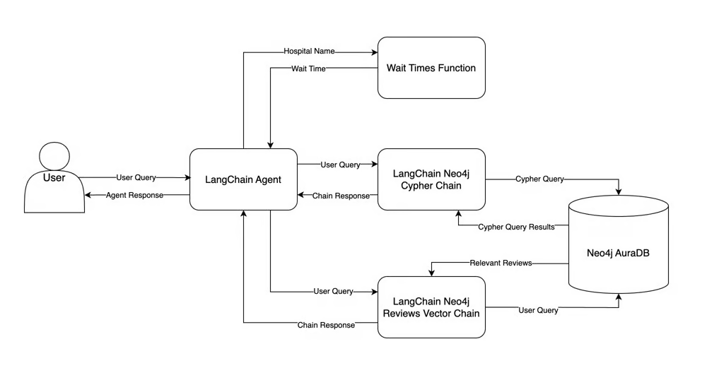
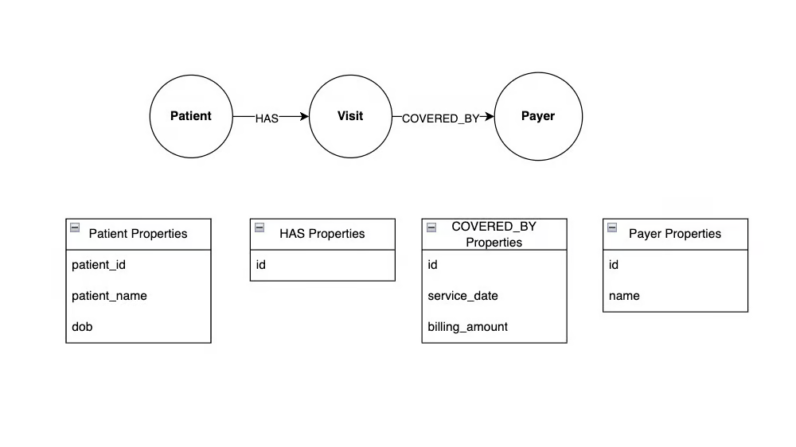

## LLM RAG Chat Bot for Hospitals

A large hospital system has stakeholders who want answers to ad-hoc questions about patients, visits, physicians, hospitals, and insurance payers
At a later stage we can add more hospital entities such as They want answers to ad-hoc questions about patients, visits, physicians, hospitals, and medical-aid payers that could be added as nodes.

Your stakeholders want to create an internal chatbot, similar to ChatGPT, designed to answer questions using a company’s data. After discussing the project requirements, you’re given examples of the types of queries the chatbot should handle, including:

How long is the current wait time at XYZ hospital?
Which hospital has the lowest wait time?
Where are patients voicing concerns about billing or insurance problems?

The core of the project is a single chat interface capable of effortlessly handling both subjective and objective queries. To achieve this, the chatbot must identify the type of question being asked and determine the appropriate data source to retrieve the information from.

All of the data you’ll use in this article was synthetically generated, and much of it was derived from a popular [health care dataset](https://www.kaggle.com/datasets/prasad22/healthcare-dataset) on Kaggle
'You could also redesign this so that diagnoses and symptoms are represented as nodes instead of properties, or you could add more relationship properties. You could do all of this without changing the design you already have. This is the beauty of graphs—you simply add more nodes and relationships as your data evolves.'

The flowchart below shows how data moves through the chatbot. We begin from the user's input query to the final response. 
We fulfill our task we utilize 
* LangChain Agent : Decides which tool (if any) must be called and what input mst be given to it based on a user's query. The agent takes the tool's output and decides what response to give the user.
* Neo4j AuraDB
* LangChain Neo4j Cypher Chain (Agent Tool)
* LangChain Neo4j Reviews Vector Chain (Agent Tol)
* Wait Times Function (Agent Tool)
* 

## Graph Databases

Represent and process data , stored as a graph. The Graph is made of nodes, edges/relationships and properties/ 
Nodes represent entities. Relationships connect entities. Properties provide additional metadata about the nodes and edges. 

This graph has three nodes - Patient, Visit, and Payer. Patient and Visit are connected by the HAS relationship, indicating that a hospital patient has a visit. Similarly, Visit and Payer are connected by the COVERED_BY relationship, indicating that an insurance payer covers a hospital visit.

Both nodes and relationships can have properties. In this example, Patient nodes have id, name, and date of birth properties, and the COVERED_BY relationship has service date and billing amount properties

Graph Database benefits:
Simple data representation, handles cpmlex relationships efficiently, flexible to changes, faster performance than relational dbs, they allow pattern matching queries 

For data with numerous complex relationships, graph databases offer simplicity and flexibility, making them easier to design and query than relational databases
